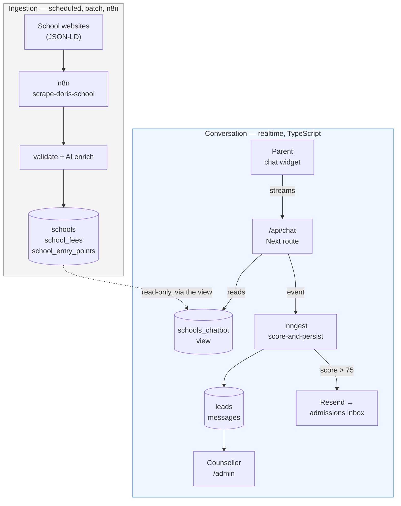

# Lawrence — prototype handover

**For:** a developer opening this repo for the first time.
**Covers:** what the prototype does, what changed in build steps 10–16, how to run and drive it
locally, and what is deliberately not finished.
**Last verified:** 2026-09-19, against a full local run of the step-16 smoke test.

> **On confidence.** Steps 13, 14 and 16 in §2 were built and verified end-to-end against a running
> stack — §6 records the result of every check. Steps 10, 11, 12 and 15 are described from the
> artifacts on disk and their step files, and step 16's smoke test exercised what they produce
> (rate limits, the seam, RLS) without re-reading them. Where the distinction matters, it is marked.

> **Running it is documented separately.** [`docs/LOCAL-DEV.md`](LOCAL-DEV.md) is the runbook: the
> prerequisites, the five processes, the seeded identities, and the traps. §4 here is the short
> version; that file is the one to follow.

---

## 1. What Lawrence is

Lawrence is a white-label admissions assistant for education agencies. A parent opens a chat
widget, has an ordinary conversation about schooling for their child, and a counsellor at the
agency later sees that conversation as a scored, profiled lead in a dashboard. The parent never
sees a score, and is never asked to fill in a form.

The one structural fact everything else depends on: **there are two flows, and they are separate.**



The only connection between them is the dotted line: the conversation **reads** the school
directory through a view and never writes to it. n8n owns ingestion and nothing else.

> The root `README.md` still describes n8n as the orchestrator of the whole platform. That was true
> until step 14 and is no longer. Trust this document and `CLAUDE.md` over the README.

---

## 2. What changed in steps 10–16

The build steps live in `.claude/docs/build-steps/`. They were executed in dependency order, which
is **not** numeric order: `10 → 11 → 12 → 15 → 13 → 14 → 16`. All seven are done. Deployment is a
separate step that has not started (§7).

| Step | Change | What it means when you open the repo |
|---|---|---|
| 10 | Docs reconciled | `CLAUDE.md` no longer claims Drizzle, better-sqlite3, shadcn/ui or the Anthropic SDK. None is installed. |
| 11 | Rate limiting | Every public endpoint has a ceiling. Three of them. |
| 12 | Provider seam + evals | No model ID may appear outside one file. `npx promptfoo eval` is the gate on changing one. |
| 15 | Tenancy + RLS | `agencies` / `agency_members`; tenant isolation is a database policy, never a query filter. |
| 13 | Admin consolidation | `src/Admin/` (Vite/React 18) deleted; eight routes rebuilt in the Next app on real rows. |
| 14 | Chat agent out of n8n | Streaming TypeScript agent, typed BANT engine, Inngest write path, counsellor-editable prompt. |
| 16 | Local end-to-end | A runbook, a one-command reset, and a nine-check smoke test that found two defects nothing else could see. |

### 10 — Documentation reconciled to `package.json`

Documentation-only; no application code changed. It mattered because every later step was generated
by a session that loads `CLAUDE.md` first, and three of its claims were false.

### 11 — Rate limiting

`src/Chatbot/lib/rate-limit.ts`. A public endpoint that bills an LLM per request has no ceiling
without this. Three independent controls, because each catches what the others cannot:

| Control | Limit | Catches |
|---|---|---|
| Per IP | 20 / 60s | Burst abuse from one source |
| Per session | 30 / 24h | Sustained drain that rotates IPs |
| Turn cap | 25 turns | One well-paced session that simply never stops |

Backed by Upstash Redis. **Unconfigured, it fails open in development and closed in production.**

The turn cap is not an error: past turn 25 the parent gets a warm close at HTTP 200, never a 429
and never a mention of a cap. *(Verified — turn 26 returns the configured copy.)*

### 12 — Provider seam and eval harness

`src/Chatbot/lib/ai/provider.ts` is the only file in the repo allowed to name a model or import a
provider SDK. Everywhere else asks for a **job**:

```ts
modelFor("parent_turn")   // not anthropic("claude-haiku-4-5")
```

| Job | Model today | Why |
|---|---|---|
| `parent_turn` | `claude-haiku-4-5` | Highest volume, most quality-sensitive |
| `bant_delta` | `claude-haiku-4-5` | Structured scoring extraction |
| `bant_refine` | `claude-sonnet-4-6` | Stage 2, the 50–75 band only |
| `school_enrich` | `gpt-4o-mini` | Ingestion; the second provider is deliberate |

Each is overridable by env, so an experiment needs no code change. Changing routing requires an
eval run — that is what the seam exists to enforce. See `.claude/rules/ai-providers.md`.

`promptfooconfig.yaml` + `evals/` grade five scoring trajectories and four persona rules against
the *same* prompt files the app runs.

### 15 — Agency tenancy

Two tables (`agencies`, `agency_members`) and an `agency_id` on `leads`. The important part is
**how** isolation works:

```sql
-- the policy, in 20260915071821_add_agency_tenancy.sql
CREATE POLICY leads_agency_select ON leads FOR SELECT USING (
  agency_id IN (SELECT current_agency_ids())
);
```

`current_agency_ids()` is a `SECURITY DEFINER` function, not a JWT claim — a revoked counsellor
loses access immediately rather than when their token next refreshes.

**Do not add an application-level `agency_id` filter on top.** Two isolation mechanisms means the
day they disagree, the wrong one is the one nobody is testing. `lib/leads.ts` deliberately contains
no `.eq("agency_id", …)`.

### 13 — Admin folded into the Next app

`src/Admin/` is gone — 37 files of Vite, React 18, and ~2,500 lines of raw-hex CSS. Its eight
screens are now routes under `src/Chatbot/app/(admin)/`, reading real `leads` and `messages` rows
through RLS, styled with `lw-*` design tokens.

One non-obvious thing was found doing it, and it is worth knowing before you add a page:

> **A layout is not a security boundary.** Next.js renders a layout and its page *concurrently*, so
> a page's data fetch starts before the layout's `redirect()` resolves. The auth gate therefore
> lives in the data layer — `requireUser()` in `lib/auth.ts`, memoised with React `cache()` — and
> every query in `lib/leads.ts` calls it. The layout redirect is a courtesy, not the gate.

### 14 — Chat agent out of n8n

The largest step. Settled by [ADR-0018](../.claude/docs/adr/0018-chat-agent-in-typescript.md),
which supersedes ADR-0006.

- **`/api/chat`** streams a turn from the seam, with `search_schools` and `offer_calendar` as AI SDK
  tools over the existing `lib/schools.ts`.
- **`lib/bant/`** holds the two-stage scoring engine, typed and unit-tested.
- **`inngest/functions/score-and-persist.ts`** does the scoring, the `leads` upsert, the `messages`
  insert, and the hot-lead email — each a separately retried step.
- **`agent_config`** is a versioned table holding the system prompt, thresholds and routing copy,
  edited from `/admin/settings`. A save inserts a new version; nothing is overwritten.
- **Deleted:** `chat-agent.json`, `bant-prequalify.json`, `/api/prequalify`, and the widget's three
  canned pre-qualification buttons.

`scrape-doris-school.json` and `link-lead.json` stay. n8n is ingestion-only.

### 16 — The local end-to-end run

Not a feature step. It is the one gate that exercises the whole path instead of a layer of it, and
the definition of "the prototype is done" agreed for this build: everything runs on a developer's
machine — chat streams, BANT scores, leads and transcripts persist, a counsellor sees the row, a
counsellor at another agency does not.

It produced three things:

- **[`docs/LOCAL-DEV.md`](LOCAL-DEV.md)** — the runbook. Prerequisites, the environment story, the
  five processes, the seeded identities, and the limitations that are stated rather than worked
  around.
- **`npm run dev:reset`** — `supabase db reset` → `seed-local-counsellors.sh` → `npm run dev`, in
  one command. Every check starts from a clean replay, because a half-migrated database produces
  failures that look exactly like code bugs.
- **A recorded smoke-test result** — §6.

#### The two defects it found

Both in `app/api/chat/route.ts`, both invisible to every other check in this repo. In AI SDK v6,
`onFinish` hands back the **last step's** `text` and `usage` — and any turn that calls a tool has at
least two steps.

1. **The stored transcript was truncated.** The parent read *"Let me search for schools…"* followed
   by the recommendation; `messages` kept only the recommendation. The counsellor was reading a
   conversation that had never happened in that form.
2. **The cost log undercounted by roughly half.** A two-step turn reported 2,299 input tokens; the
   same turn reports 4,634 once totalled. Effective cost per conversation is the single metric
   ADR-0015 is to be decided on, and nothing else records it.

Both now aggregate across `steps` and `totalUsage`. Note what they have in common with the three
defects below: **the live behaviour was correct and only the record of it was wrong**, which is
precisely the class of bug that a unit test, a type checker and a passing eval all wave through.
Running the thing end to end is the only check that sees them.

### The three defects this arc fixed

The reason step 14 happened at all. All three had been live for months.

1. **Nothing had ever emailed the admissions team.** The only Gmail node hung off a `Switch` branch
   that arithmetic proved unreachable: the Stage-1 scorer's ceiling is 67 and the gate was `> 75`.
   The escalation the entire two-stage design exists to produce had never once fired.
2. **The scorer read negations as maximum signal.** `"not my decision"` scored authority 22 of 25,
   because `"my decision"` is a substring of it and the chain tested the positive branch first.
   `"we cannot afford premium"` scored budget 22. A parent disqualifying themselves on two
   dimensions scored 47 — comfortably into Stage 2.
3. **Stage 2 scored the advisor's reply, not the parent's.** `re-scoreJS` opened with
   `const aiReply = $json.reply.toLowerCase()`. A warm turn mentioning September and entrance exams
   awarded the parent timeline +10 and need 20 for saying nothing at all.

None is an n8n defect; they are ordinary bugs. What matters is that all three survived months of
live use in a medium with no types, no tests, no meaningful diff and no local run. Numbers 2 and 3
are now regression tests in `lib/bant/*.test.ts`.

---

## 3. How it fits together now

### The request path is read-only

The parent's HTTP request does exactly two things: stream a reply, and enqueue an event. It never
writes to the database.

```
POST /api/chat
  ├─ rate limit          (ceiling before any spend)
  ├─ read agent_config   (service key — the parent is anonymous)
  ├─ streamText(...)     ──► tokens to the browser
  └─ onFinish
       ├─ logAiCall(...)          [ai-cost] one line, counts only, never text
       └─ inngest.send(...)       ──► the write path, off the response path
```

Scoring happens **after** the stream closes, so it never delays a token, and a failed write is
retried rather than lost.

### The score never reaches the browser

`/api/chat` responds with **plain text** — not JSON, not a UI message stream. There is no field in
the response for a score, a tier, or a BANT breakdown to leak into. That is the cheapest possible
guarantee, and it is deliberate.

The browser's `localStorage` holds the session id and the transcript for display, and nothing else.
It used to hold the score; it no longer does, because a value the parent must never see should
never have been in their browser.

### Three Supabase clients — picking one is a security decision

| Client | Key | Used by |
|---|---|---|
| `getSupabaseServerClient()` | anon | Public schools directory. No session, so RLS sees no `auth.uid()`. |
| `getSupabaseRequestClient()` | anon + session cookies | Everything behind auth. RLS scopes by agency. |
| `getSupabaseAdminClient()` | **service role** | Inngest write steps, and the anonymous chat route's `agent_config` read. **Bypasses RLS.** |

Never reach for the admin client from a component, a `"use client"` file, or an Admin page. Admin
writes go through the cookie-bound client so the owner-only policies decide, not the route.

### Scoring, in two stages

```
Stage 1   keyword matching, no model call, 3 dimensions, ceiling 67
          └─ below 25 → stop here. The parent still gets a full warm reply;
                        Stage 1 gates *spend*, never warmth.
Stage 2   a model rates all 4 dimensions absolutely over the PARENT's words
          └─ lands 50–75 → run again on a stronger model (the band where a
                           counsellor's time is on the line and it is close)
Routing   < 50 resources · 50–75 booking · > 75 notify admissions
```

Thresholds come from `agent_config.bant_thresholds`, not from a constant. A counsellor changes them
without a deploy. See `.claude/rules/bant-scoring.md` and ADR-0017.

---

## 4. Running it locally

> The full runbook is [`docs/LOCAL-DEV.md`](LOCAL-DEV.md). What follows is the shape of it, so this
> document stands on its own; where the two disagree, that file is newer.

### Prerequisites

- A Docker engine — Docker Desktop or Rancher Desktop. **Start it yourself**; `supabase start`
  will not, and its failure message talks about a missing socket rather than a missing app.
- Node.js 22 — what this was built and verified on. No `engines` field is declared, so
  older majors are untested; the test runner needs `node --test` with a loader.
- Supabase CLI (`brew install supabase/tap/supabase`)
- An `ANTHROPIC_API_KEY`

### Environment

```bash
cp .env.example .env.local   # at the repo root, NOT in src/Chatbot
```

`.env.local` is gitignored and never read into an AI session. Fill in the values yourself; see §8
for what each one does. The minimum to get a conversation working is `ANTHROPIC_API_KEY`,
`NEXT_PUBLIC_SUPABASE_URL`, `NEXT_PUBLIC_SUPABASE_ANON_KEY`, `SUPABASE_SERVICE_ROLE_KEY`.

> **Which database am I talking to?** Whatever `NEXT_PUBLIC_SUPABASE_URL` says. By default that is
> the **hosted** project, not the local one — and against hosted, `/api/chat` 500s on the first turn
> because the `agent_config` migration has not been pushed. Getting this wrong is the single easiest
> way to be confused for an hour.

The fix is a second, git-ignored file rather than an edit to `.env.local`, which other tooling still
needs pointed at hosted:

```
src/Chatbot/.env.development.local
```

Next.js loads `.env.development.local` **before** `.env.local`, so its keys win in `npm run dev`
while everything it does not mention — your `ANTHROPIC_API_KEY`, the Upstash pair — still comes from
`.env.local`. It overrides the three Supabase variables with the local stack's, which are the fixed,
published development keys, not secrets. Read them from `supabase status -o json`.

### Start the processes

```bash
# 1 — database. Replays every migration and seed.
supabase start
supabase db reset

# 2 — the two local counsellors. `db reset` wipes auth.users, so this comes after it.
./scripts/seed-local-counsellors.sh

# 3 — the durable write path.
npx inngest-cli@latest dev -u http://127.0.0.1:3000/api/inngest

# 4 — the app. `predev` stages the prompts into .prompts/ automatically.
cd src/Chatbot && npm run dev              # http://localhost:3000
```

Steps 1–4 in one command, from `src/Chatbot`: **`npm run dev:reset`**.

| Process | Port | Dashboard |
|---|---|---|
| Supabase | 54321 (API), 54322 (db) | Studio on 54323, Mailpit on 54324 |
| Next.js | 3000 | — |
| Inngest | 8288 | http://localhost:8288 |

`inngest-cli` registers by fetching `/api/inngest`, so it needs the app — but it retries and
auto-discovers, so starting it first is fine; it syncs as soon as the app comes up. To stop it:
`lsof -ti:8288 | xargs kill`.

> **Without Inngest running, the chat still streams perfectly and nothing persists.** The route
> catches the enqueue failure and logs `[chat] could not enqueue chat/turn.completed`. No lead, no
> transcript, no email — and the UI gives you no hint. If leads are not appearing, check port 8288
> before anything else.

No Inngest keys are needed locally. `inngest/client.ts` passes `isDev: !IS_PRODUCTION` explicitly —
**v4 does not infer dev mode from `NODE_ENV`**, and without that line it runs in cloud mode, where
`PUT /api/inngest` 500s and every `send` fails for want of an event key.

### The two seeded counsellors

`seed-local-counsellors.sh` above creates `counsellor@demo-agency.test` and
`counsellor@rival-agency.test` and links their agency memberships. It runs *after* the reset because
`supabase db reset` wipes `auth.users` and the seed cannot fabricate a UUID for a user that does not
exist yet.

The second identity is not decoration. It is the only way to run check 5, and check 5 is the only
one that proves cross-tenant isolation rather than assuming it.

---

## 5. Driving it

### As a parent

Open http://localhost:3000 and click the chat button, bottom right. Type — there are no buttons to
click through any more. Tokens should appear progressively; if the whole reply arrives at once,
streaming is broken.

Try something with real signal in it:

> *"We're relocating to Hong Kong next month and need a place at a selective international school
> before the September term. I'm handling the search myself. The entrance assessments worry me most."*

### Watch the lead land

Within a few seconds of the stream closing, the Inngest dashboard (http://localhost:8288) shows a
`score-and-persist` run with its four steps. Then:

```bash
docker exec supabase_db_lawrence psql -U postgres -d postgres -c \
  "SELECT id, score, classification, location, timeline, forcing_function FROM leads ORDER BY created_at DESC LIMIT 1;"
```

You should see a score in the 90s, `classification = hot`, and the profile fields extracted from
what the parent actually said.

### As a counsellor

Go to http://localhost:3000/admin. You will be redirected to `/sign-in`. Sign in as
`counsellor@demo-agency.test` (password from the seed script). The lead is in the list with its
real score.

To prove isolation rather than assume it: sign in as `counsellor@rival-agency.test` and confirm the
same lead is **not** visible, and that its detail URL 404s.

### Edit the prompt without a deploy

This is the capability that justified putting the agent in n8n in the first place, and the reason
it could come back out.

1. Go to `/admin/settings` — it is **Assistant** in the sidebar, not "Settings".
2. Change the system prompt — try adding *"Begin every reply with AVAST."*
3. Save. It inserts **version 2**; version 1 is untouched.
4. Start a new conversation in the widget. The next turn obeys the new prompt. No restart.
5. In the History list, click **Make this live** on version 1. Reverted.

The database enforces one active version per agency with a partial unique index, so two saves
racing is a constraint violation rather than a coin flip.

---

## 6. Checking your work

```bash
cd src/Chatbot
npm test          # 15 unit tests, ~60ms, no network
npm run build     # typecheck + production build
cd ../..
npx promptfoo eval  # 9 graded cases against a real model — costs a few cents
```

What each actually proves:

| Command | Proves |
|---|---|
| `npm test` | The negation fix holds; a malformed model response throws instead of silently scoring zero; ADR-0017's measured score table still reproduces. |
| `npm run build` | Types are sound and every route compiles. |
| `npx promptfoo eval` | Five scoring trajectories still land in the same routing tier, and four persona rules hold — one question per turn, no qualification vocabulary reaching the parent, an objection reframed rather than overcome, and no false denial of being scored. |

> **The trap that will cost you an hour.** An `ANTHROPIC_API_KEY` exported in your shell takes
> precedence over `.env`. If evals fail on auth, check the shell before the file:
>
> ```bash
> env -u ANTHROPIC_API_KEY npx promptfoo eval
> ```

### The smoke test

The nine end-to-end checks are step 16's definition of done, listed in full in
[`docs/LOCAL-DEV.md`](LOCAL-DEV.md#the-smoke-test). None of them passes by a unit test. The run of
2026-09-19, from a clean `supabase db reset`:

| # | Check | Result |
|---|---|---|
| 1 | Streaming — first token before the full reply | **pass** — 1.28 s to first byte, 4.83 s to close |
| 2 | No score, tier, band or threshold reaches the parent | **pass** — grep of the raw payload, zero hits |
| 3 | Lead and transcript persist correctly | **pass** — score 88, `hot`, right agency, profile extracted, 4 messages in order |
| 4 | The demo counsellor sees the lead in `/admin` | **pass** — mono score, band badge |
| 5 | The rival counsellor does **not** | **pass** — also proven at the API: demo 9 leads, rival 2, anon 0 |
| 6 | Prompt edited in Admin changes the next turn; revert restores | **pass** — no restart, no deploy |
| 7 | `npx promptfoo eval` | **pass** — 9/9 |
| 8 | 21st request from one IP is 429; turn 26 closes warmly at 200 | **pass** |
| 9 | Unauthenticated `/admin` redirects to sign-in | **pass** — 307 |

Check 5 is the only one that proves RLS rather than assuming it, and check 3 is what caught the two
defects in §2. Re-run the whole list after any change to the write path.

**Run the evals before changing a prompt or a model.** The persona assertions are graded by a
model, so an occasional single failure is noise — re-run before treating it as a regression. A
consistent failure across runs is real. Prompt edits have measurable side effects: during step 14,
strengthening one rule measurably weakened another, and only the suite caught it.

---

## 7. What isn't done

Read this section before estimating anything.

| Gap | Impact |
|---|---|
| **`RESEND_API_KEY` is unset** | The hot-lead email has never been sent end-to-end. Scoring, the idempotency claim, and the claim-release-on-failure all work; only the third-party call is untested. This is the defect the whole arc was meant to fix, so it is worth keying first. |
| **Hosted is one migration behind** | `20260916181457_create_agent_config` is local-only. Against hosted, `/api/chat` 500s immediately with *"No active agent_config row"*. |
| **Ingested schools land invisible to the agent** | `scripts/upsert-schools.mjs` writes `scrape_status = 'needs_review'` — correctly, since JSON-LD cannot fill `curricula`, `strengths` or `sen_support` — and `schools_chatbot` exposes only `ok`. Hosted has 6 schools, 5 of them `needs_review`. There is no promotion step; `LOCAL-DEV.md` gives the SQL for a local run and says plainly that the records are incomplete. |
| **`supabase db reset` wipes the school directory** | Schools come from ingestion, not from a migration or seed. After a reset the agent honestly tells a Bangkok parent it has nothing until you repopulate. |
| **Deployment has not started** | Vercel, the KVM1, DNS, monitoring and backups are the step after this one. Steps 10–16 end at "green on a laptop", deliberately. |
| **`next` is 16.3.1** | Two critical RCE advisories, fixed in 16.3.3, already inside the `^16.3.1` range — `npm update next` picks it up. |
| **Step 16's own changes are uncommitted** | `docs/LOCAL-DEV.md`, the `dev:reset` script and the two `route.ts` fixes sit in the working tree. Steps 10–14 are committed. |
| **Returning users see stale chat history** | `localStorage` survives the cutover, including n8n-era canned replies. Cosmetic, but it is what you will see first. |
| **Drizzle is the decided target, not the state** | ADR-0013 names it for app-owned tables. It is not installed. Do not generate code against it. |

---

## 8. Reference

### Environment variables

| Variable | Purpose |
|---|---|
| `ANTHROPIC_API_KEY` | Parent turns, BANT scoring |
| `OPENAI_API_KEY` | Ingestion enrichment only |
| `NEXT_PUBLIC_SUPABASE_URL` | **Decides which database you are talking to** |
| `NEXT_PUBLIC_SUPABASE_ANON_KEY` | Public + cookie-bound clients |
| `SUPABASE_SERVICE_ROLE_KEY` | Write path. Bypasses RLS. Read in exactly one file. |
| `AGENCY_SLUG` | Which tenant the widget writes into. Default `demo-agency`. |
| `UPSTASH_REDIS_REST_URL` / `_TOKEN` | Rate limiting. Unset = open in dev, closed in prod. |
| `RESEND_API_KEY` / `RESEND_FROM` / `ADMISSIONS_EMAIL` | Hot-lead escalation |
| `CALENDLY_URL` | Returned by the `offer_calendar` tool |
| `NEXT_PUBLIC_SITE_URL` | Builds the deep link in the hot-lead email |
| `N8N_LINK_LEAD_WEBHOOK_URL` | Post-sign-in identity link (ADR-0008) |
| `AI_MODEL_*` | Per-job model overrides; defaults live in the seam |

Never commit real values. `.env.example` carries placeholders only —
see `.claude/rules/secrets.md`.

### Where things live

| Path | What |
|---|---|
| `src/Chatbot/app/api/chat/` | The parent-facing agent. Streams plain text. |
| `src/Chatbot/lib/ai/provider.ts` | **The only file allowed to name a model** |
| `src/Chatbot/lib/bant/` | Two-stage scoring engine + tests |
| `src/Chatbot/inngest/` | Durable write path |
| `src/Chatbot/app/(admin)/` | Counsellor dashboard, behind auth + membership |
| `src/agents/prompts/` | System prompts as `.txt`. The evals read these same files. |
| `supabase/migrations/` | Schema history |
| `.claude/docs/adr/` | Why things are the way they are. Start at ADR-0018. |
| `.claude/rules/` | Constraints that apply to all new code |
| `docs/LOCAL-DEV.md` | The runbook: processes, identities, smoke test |
| `n8n/workflows/` | Ingestion only — two workflows |

### Commands

```bash
supabase start / stop / db reset       # local database
bash scripts/seed-local-counsellors.sh # recreate auth users after a reset
supabase migration list                # compare local vs hosted
supabase db push                       # apply migrations to hosted

cd src/Chatbot
npm run dev            # port 3000; predev stages the prompts
npm run dev:reset      # reset + reseed counsellors + dev, in one command
npm test               # unit tests
npm run build          # typecheck + build
npm run sync-prompts   # restage .prompts/ manually

npx inngest-cli@latest dev -u http://localhost:3000/api/inngest
lsof -ti:8288 | xargs kill             # stop Inngest

npx promptfoo eval                     # from the repo root
```

### Further reading

- [ADR-0018](../.claude/docs/adr/0018-chat-agent-in-typescript.md) — why the agent is TypeScript
- [ADR-0017](../.claude/docs/adr/0017-bant-routing-thresholds.md) — thresholds, and the two defects
- [ADR-0016](../.claude/docs/adr/0016-agency-tenancy-model.md) — the tenancy model
- [ADR-0015](../.claude/docs/adr/0015-ai-model-provider-strategy.md) — model routing
- [`docs/LOCAL-DEV.md`](LOCAL-DEV.md) — the runbook this document summarises in §4 and §6
- `.claude/docs/stack-audit.md` — the scorecard that produced steps 10–16
- `.claude/rules/` — read before writing code
